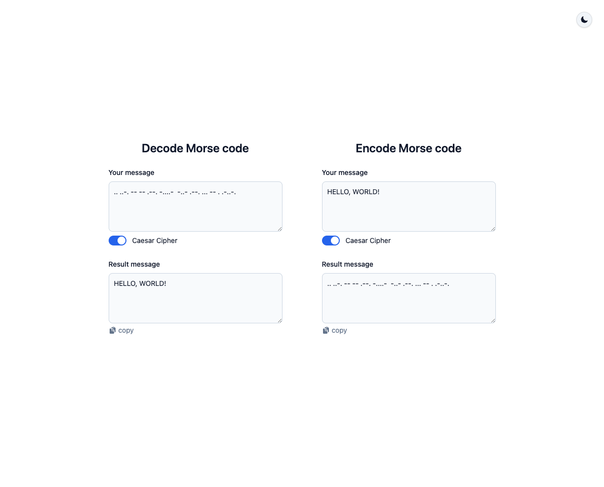
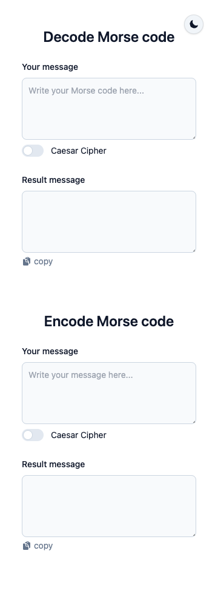

# Morse Code Translator

Live Demo: https://mechapear.github.io/code-translator-react/

## Features

- Decode Morse Code to plain text and Caesar Cipher
- Encode plain text with Morse Code
- Convert plain text to Caesar Cipher and encode it with Morse Code
- Copy to clipboard with a sigle click
- Responsive design
